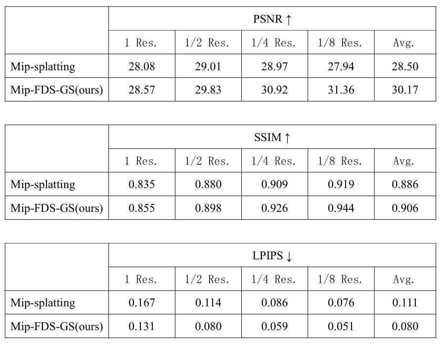

# Mip-FDS-GS: Alias-free 3DGS method based on FDS-GS without Gaussian scale mismatch

## Overview

This work eliminates the gaussian scale mismatch phenomenon mentioned in SA-GS.
We achieve much better results than SOTA (SA-GS and Mip-splatting) on Blender and Mipnerf360 datasets both same scale testing and multi-scale testing (with still single-scale training).
Glad to introduce our baseline work FDS-GS (AAAI 2025) https://github.com/whoiszzj/FDS-GS.


!(pics/Mipnerf360_2.png)



## Installing

Our code were tested under Ubuntu 22.04 with GPU A100. The Cuda version is 11.8 and the PyTorch version is 2.4.1.

 ```bash
 git clone https://github.com/npc1507277/Mip-FDS-GS.git
 cd Mip-FDS-GS
 conda env create --file environment.yml
 # install torch kdtree
 git clone https://github.com/thomgrand/torch_kdtree
 cd torch_kdtree
 git submodule init
 git submodule update
 pip install .
 ```

## Thanks

Thanks for all the open source projects / datasets.

> 3DGS: https://github.com/graphdeco-inria/gaussian-splatting
>
> TorchKDTree: https://github.com/thomgrand/torch_kdtree
>
> MipNeRF360: https://jonbarron.info/mipnerf360/
>
> Tanks \& Temples: https://www.tanksandtemples.org/
>
> Deep Blending: https://github.com/Phog/DeepBlending

